  

  
  
  

## About

- **Research:** cancer multi-omics — long-read transcriptomics, single-cell atlases and tissue-to-serum biomarkers.
- **Tools:** when an analysis step keeps being trusted on faith, I turn it into a tool that records its evidence and says when the evidence is not enough.
- **Notes:** before relying on a method, I recompute it by hand and write down where the textbook and the software disagree.

## Tools & packages

<table>
  <tr>
    <td width="50%" valign="top">
      <h3><a href="https://github.com/jibeomko/PanIsoGuard">PanIsoGuard</a></h3>
      
      
      
      
      
Decides which <b>novel isoforms</b> from a long-read RNA-seq caller to trust, and records why.

      
Runs on SQANTI3 output from any caller (FLAIR, IsoQuant, Bambu, ESPRESSO, TALON …). Each isoform gets one of seven confidence classes, the rule that decided it, and a provenance log of the evidence used.

      Alpha · <a href="https://github.com/jibeomko/PanIsoGuard#quick-start">Quick start →</a>
    </td>
    <td width="50%" valign="top">
      <h3><a href="https://github.com/jibeomko/pdactrace">pdactrace</a></h3>
      
      
      
      
Stage-aware <b>PDAC multi-omics atlas</b> with a deterministic claim-audit framework for tissue-to-blood biomarker evidence.

      
Keeps "tissue marker", "serum-observed signal" and "serum-concordant biomarker" as separate claim tiers across bulk RNA-seq, tissue and serum proteomics, single-cell origin and pancreatitis context. An audit, not a trained classifier.

      <code>remotes::install_github("jibeomko/pdactrace")</code>
    </td>
  </tr>
  <tr>
    <td colspan="2" valign="top">
      <h3><a href="https://github.com/jibeomko/poisson-to-deseq2">poisson-to-deseq2</a></h3>
      
      
      
      
Study notes on <b>DESeq2</b>, from why a Poisson model is not enough to which genes <code>padj</code> is adjusted over.

      
One gene is followed through every step; each number is recomputed by hand and checked against DESeq2.

    </td>
  </tr>
</table>

## Publications

- Hwang Y, Kim J, **Ko JB**, Han Y, Kim Y, Lee KH, Jang S. **From affinity to kinetics: SPR as the analytical backbone of AI-driven drug discovery.** *TrAC Trends in Analytical Chemistry* 204, 119089 (2026). [doi:10.1016/j.trac.2026.119089](https://doi.org/10.1016/j.trac.2026.119089)

Full list on <a href="https://orcid.org/0009-0002-8630-1973">ORCID</a>.

## Stack

<table>
  <tr>
    <td><b>Languages</b></td>
    <td></td>
  </tr>
  <tr>
    <td><b>Build & ship</b></td>
    <td></td>
  </tr>
  <tr>
    <td><b>ML</b></td>
    <td></td>
  </tr>
  <tr>
    <td><b>Apps & design</b></td>
    <td></td>
  </tr>
</table>

## Research toolkit

| Area | Methods & tools |
|---|---|
| Long-read transcriptomics | PacBio HiFi · ONT · minimap2 · SQANTI3 · IsoQuant · FLAIR · Bambu · ESPRESSO · TALON |
| Expression & single-cell | DESeq2 · DEXSeq · Seurat · scvi-tools · CellChat · BayesPrism |
| Proteomics | FragPipe (DDA / DIA) · DEqMS |
| Statistical genetics | Mendelian randomization (TwoSampleMR) · colocalization (coloc) |
| Structure | AlphaFold 3 · Boltz · Chai-1 · molecular docking |
| Workflows | Snakemake · Nextflow · conda / bioconda · Docker |
